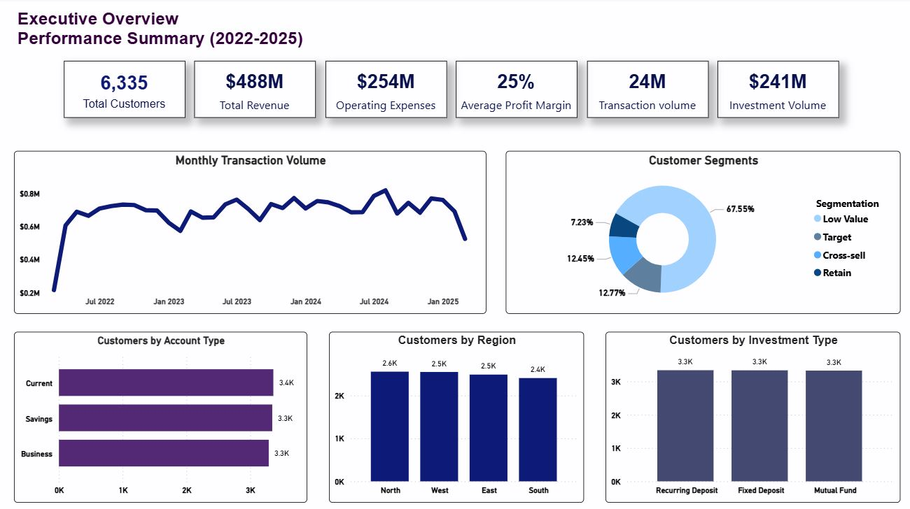
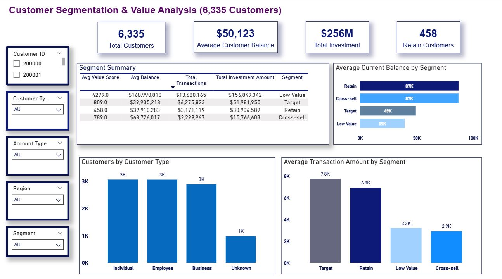
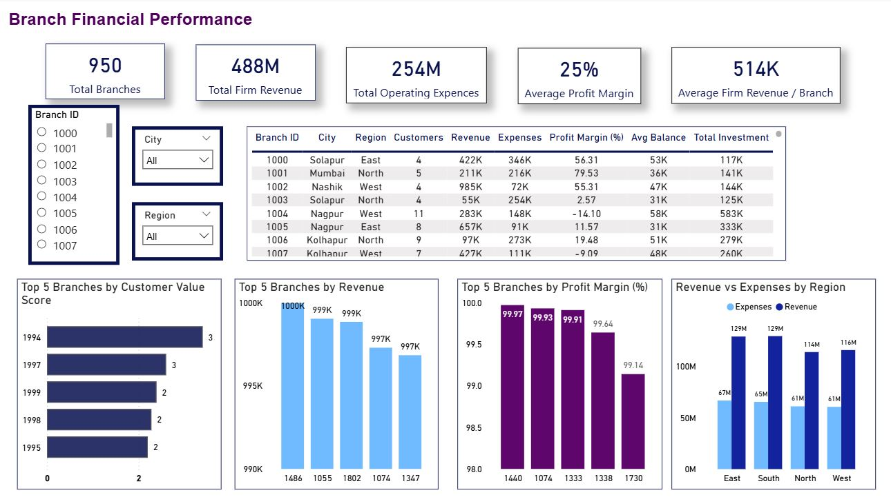

# 🏦 Banking Customer Analytics & Customer Segmentation

### EEnd-to-End Banking Analytics Project using SQL & Power BI

<p align="center">
  
</p>

<p align="center">


</p>

---

## 🎯 Business Problem

Retail banks generate large volumes of customer and transaction data every day. However, without a centralized analytics solution, it is difficult to identify high-value customers, evaluate branch performance, and support strategic decision-making.

This project was developed to transform raw banking data into meaningful business insights through SQL analysis, customer segmentation, and interactive Power BI dashboards.

---

## 🎯 Project Objectives

✔ Analyze customer behavior and financial activity

✔ Segment customers into Retain, Target, Cross-sell, and Low Value groups

✔ Evaluate branch and regional performance

✔ Design executive dashboards for business decision-making

✔ Deliver actionable business recommendations

---

## 🛠️ Tech Stack

| Tool | Purpose |
|------|---------|
| MySQL | Data Cleaning & Analysis |
| SQL | Data Analysis |
| Power BI | Dashboard Development |
| Git & GitHub | Version Control |


---

## 🔄 Project Workflow

```text
Raw CSV Files
      │
      ▼
Data Cleaning (SQL)
      │
      ▼
Data Validation
      │
      ▼
Exploratory Data Analysis
      │
      ▼
Customer Segmentation
      │
      ▼
Business KPI Development
      │
      ▼
Interactive Power BI Dashboard
```
---

## 📊 Dashboard Preview

### 🏠 Executive Overview


### 👥 Customer Segmentation & Value Analysis



### 🏦 Branch Financial Performance



---

## 🔍 Key Business Insights

- 📈 Retain customers maintain the highest average account balance.
- 🎯 Target customers generate the highest transaction activity.
- 💰 Cross-sell customers present opportunities for additional financial products.
- 🏦 Branch performance varies significantly by revenue and profit margin.
- 🌍 Regional comparisons highlight differences in revenue and operating expenses.

---

## 💡 Business Recommendations

- Focus retention strategies on high-value customers.
- Expand cross-selling campaigns for customers with strong financial potential.
- Investigate lower-performing branches to improve profitability.
- Optimize regional resource allocation using revenue and expense trends.
- Monitor customer value metrics to support long-term business growth.

---

## 🚀 Skills Demonstrated

- SQL (Joins, CTEs, Window Functions)
- Data Cleaning & Validation
- Exploratory Data Analysis (EDA)
- Customer Segmentation
- KPI Development
- Star Schema Data Modeling
- Power BI Dashboard Design
- Data Storytelling
- Business Analytics

- ---

## 📁 Repository Structure

```text
banking-customer-analytics/
│
├── data/
├── sql/
├── powerbi/
├── dashboard/
├── executive-summary/
├── README.md
└── LICENSE
```
